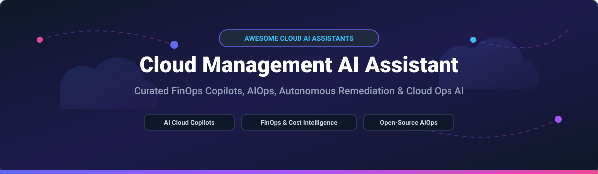

<!-- Banner -->

  

# ⚡ Awesome Cloud Management AI Assistant 🚀

  
  
  
  
  
  

> **Curated List of SaaS Products & Open-Source GitHub Projects**
> 
> *Focused on Cloud Operations Copilots, AI-Powered FinOps, Cost Optimization, LLM Observability & Autonomous Remediation.*
> 
> **Last updated: October 2026**

---

## 🔍 Overview & Key Capabilities 💡

This repository tracks top-tier **SaaS platforms** and **open-source projects** for **Cloud Management AI Assistants**, **AIOps Copilots**, and **FinOps Intelligence Engines**. These solutions empower cloud architects, DevOps engineers, SREs, and platform teams to manage multi-cloud infrastructure (AWS, Azure, GCP, Kubernetes) using natural language—enabling automated incident diagnostics, infrastructure rightsizing, continuous cost optimization, and policy-driven autonomous remediation.

**Key Use Cases Covered:**
- 🤖 **Natural Language Cloud Operations**: Query infrastructure telemetry, cloud logs, and Kubernetes events using conversational AI.
- 💰 **AI-Driven FinOps & Cost Intelligence**: Automatically allocate cloud spend, identify idle resources, rightsize workloads, and detect cost anomalies.
- 🛡️ **Autonomous Remediation & Security**: Automated root-cause analysis (RCA), policy enforcement, and self-healing cloud infrastructure.

---

## 📖 Table of Contents 📌

- [☁️ SaaS/Hosted Platforms](#️-saashosted-platforms)
- [🔓 Open-Source GitHub Projects](#-open-source-github-projects)
- [🤝 How to Contribute](#-how-to-contribute)
- [☕ Support & Sponsorship](#-support--sponsorship)
- [📈 Star History](#-star-history)
- [⚠️ Disclaimer](#️-disclaimer)

---

## ☁️ SaaS/Hosted Platforms 🌐

> **📊 Market Context & Fragmentation Analysis**:
> The global cloud cost management & FinOps market size is estimated at **~$5.5 Billion in 2026** and is projected to reach **~$16.0 Billion by 2031** at a **Compound Annual Growth Rate (CAGR) of ~24%**. The market is **highly fragmented** with no single vendor maintaining a winner-take-all dominance. Hyperscalers (AWS, Microsoft Azure, Google Cloud) bundle generative AI assistants (Amazon Q, Azure Copilot, Gemini) into baseline enterprise subscriptions to drive cloud consumption, while specialized observability and FinOps enterprise suites (Datadog, Dynatrace, New Relic, CloudZero, Vantage, Cast AI) differentiate via deep multi-cloud telemetry, autonomous pod rightsizing, and specialized MCP (Model Context Protocol) tool integrations. Additionally, standard enterprise pricing model shifts now combine base user subscriptions with metered "AI Credit" consumption for complex autonomous multi-agent workloads.

### 🏢 Comparison of Top SaaS Cloud Management AI Assistants

*Sorted by Company Revenue / Enterprise Size (Descending).*

| Platform 🚀 | Description 📝 | Starting Tier Pricing 💵 | Free Tier / Free Trial Limits 🎁 | Company Size (Revenue / Valuation) 🏛️ |
|:---|:---|:---|:---|:---|
| **[AWS Generative AI Assistant (Amazon Q)](https://aws.amazon.com/)** | AI-powered cloud operations assistant within AWS Console. Natural language queries for resource discovery, cost analysis, and troubleshooting via Amazon Q. | **$19/user/month** (Amazon Q Developer Pro) | **AWS Free Tier**: $100–$200 credits for new accounts; **Amazon Q Developer Free Tier**: Limited monthly query & code suggestions cap. | **~$638B revenue** (Amazon FY2025) |
| **[Google Cloud Duet AI (Gemini)](https://cloud.google.com/)** | AI collaborator across Google Cloud. Natural language assistance for infrastructure, code, and operations. Branded as **Gemini for Google Cloud**. | **$6/user/month** (Gemini Business tier) | **Google Cloud Free Tier**: $300 credit valid for 90 days. No perpetual free tier for Gemini Enterprise. | **~$350B revenue** (Alphabet FY2025) |
| **[Microsoft Azure Copilot](https://azure.microsoft.com/)** | AI assistant for Azure operations. Natural language queries for resource management, cost analysis, and troubleshooting. Integrated with Azure portal and M365 Copilot. | **$21/user/month** (Copilot Business tier) | **M365 Copilot Chat**: Free for eligible Entra users with metered workloads for advanced experiences. 30-day trial for enterprise evals. | **~$281B revenue** (Microsoft FY2025) |
| **[IBM Turbonomic AI](https://www.ibm.com/products/turbonomic)** | Application resource management with AI-driven optimization. Real-time workload placement and rightsizing tied to performance SLOs. | **$18.75/month** (Starting cloud tier) | **30-day full-access free trial** (no credit card required). No perpetual free tier. | **~$63B revenue** (IBM FY2025) |
| **[Datadog Bits AI](https://www.datadoghq.com/)** | AI assistant for cloud observability and incident investigation. Natural language queries for logs, traces, and metrics. | **$36/host/month** (APM Pro annual starting rate) | **14-day full-access free trial** with full platform capabilities. No perpetual free tier. | **~$2.5B revenue** (Datadog FY2025 est.) |
| **[Dynatrace Davis AI](https://www.dynatrace.com/)** | Causal AI engine for root cause analysis using Smartscape topology. Deterministic and causal AI for automated remediation. | **$0.02/GiB/day** (Infrastructure Monitoring log retention starting rate) | **15-day full-access free trial**. No permanent perpetual free tier. | **~$1.5B revenue** (Dynatrace FY2025 est.) |
| **[New Relic Grok](https://newrelic.com/)** | AI observability assistant powered by Grok for natural language telemetry queries and anomaly detection. | **$49/user/month** (Standard annual plan) | **Perpetual Free Tier**: 100 GB data ingest/month, 1 full-platform user, unlimited basic users. | **~$1B revenue** (New Relic FY2025 est.) |
| **[CloudZero](https://www.cloudzero.com/)** | Cloud cost intelligence platform with AI-powered allocation. Ingests AI vendor spend alongside AWS/Azure/GCP, normalizes, and allocates to teams and products. | **$4,166/month** ($50,000/year starting annual contract) | **14-day guided proof-of-concept trial** upon enterprise request. | **Private (~$100M+ raised)** |
| **[Cast AI](https://cast.ai/)** | Autonomous Kubernetes cost optimization with **Kimchi serverless model API**. Actively right-sizes pods, manages spot interruptions, and consolidates nodes. | **$1,000/month base + $5/vCPU/month** (Growth tier) | **Perpetual Free Monitoring Tier**: Unlimited clusters for cost visibility (read-only monitoring, no autonomous optimization). | **Private (~$100M+ raised)** |
| **[Vantage](https://www.vantage.sh/)** | Cloud cost transparency platform with **Vantage MCP Server** exposing 127 tools for AI-assisted cost queries. VQL query language for custom cost questions. | **$50/month** (Pro plan starting tier) | **Perpetual Free Starter Tier**: Free tier supporting up to $2,500/month tracked cloud spend. | **Private (~$50M+ raised est.)** |

---

## 🔓 Open-Source GitHub Projects 🛠️

*Sorted by GitHub_Stars_Count (Descending). Stars_Badges link directly to repo stargazers pages.*

| Open-Source Repo 📦 | Description 📜 | GitHub_Stars ⭐ |
|:---|:---|:---|
| **[Cloud Custodian](https://github.com/cloud-custodian/cloud-custodian)** | **CNCF Incubating cloud governance & remediation engine.** YAML-based DSL for real-time policy enforcement, off-hours resource scheduling, garbage collection of unused cloud assets, and tag compliance across AWS, Azure, and GCP. Apache-2.0. |  |
| **[Prowler](https://github.com/prowler-cloud/prowler)** | **Open-source multi-cloud security assessment & remediation tool.** Integrates **Lighthouse AI** agentic cloud defense for automated natural language security fixes across AWS, Azure, GCP, and Kubernetes. Apache-2.0. |  |
| **[Steampipe](https://github.com/turbot/steampipe)** | **Zero-ETL relational SQL engine for live cloud infrastructure.** Query AWS, Azure, GCP, and Kubernetes resources directly with SQL. Features 150+ plugins to detect unattached storage, idle VMs, and cost allocation tags. Apache-2.0. |  |
| **[OpenCost](https://github.com/opencost/opencost)** | **CNCF Incubating open-source cost monitoring engine for Kubernetes.** Real-time cost allocation by cluster, node, namespace, controller, service, or pod. Supports multi-cloud pricing APIs, GPU cost tracking, and features a native MCP server for LLM agent integration. Apache-2.0. |  |
| **[KubeVela](https://github.com/kubevela/kubevela)** | **CNCF Application Delivery Platform & OAM Engine.** Modern open-source platform engine that enables AI-driven application delivery, multi-cloud workflow orchestration, and automated operational policy enforcement. Apache-2.0. |  |
| **[OptScale](https://github.com/hystax/optscale)** | **Open-source multi-cloud FinOps & AI/ML workload cost optimization platform.** Ingests billing and telemetry data from AWS, Azure, GCP, and K8s. Combines cost visibility, ML model training cost allocation, budget tracking, and policy-based alerts. Apache-2.0. |  |
| **[Kubecost Engine](https://github.com/kubecost/cost-analyzer-helm-chart)** | **Kubernetes cost management Helm distribution built on OpenCost.** Free Community Edition supports cost tracking, rightsizing recommendations, and alert integrations for clusters up to 250 cores. Apache-2.0 / Proprietary. |  |
| **[Infracost](https://github.com/infracost/infracost)** | **Shift-left cloud cost estimates for Terraform.** Automatically calculates infrastructure cost diffs in Pull Requests before deployment, preventing budget overruns. Apache-2.0. |  |
| **[KubeCopilot](https://github.com/feiskyer/kube-copilot)** | **Kubernetes AI assistant powered by OpenAI LLMs.** Executes natural language cluster diagnostics, log auditing, security inspection, and manifest generation directly via `kubectl`. MIT. |  |
| **[K8sGPT](https://github.com/k8sgpt-ai/k8sgpt)** | **AI-powered Kubernetes diagnostic scanner & operator.** Gives Kubernetes clusters super powers to diagnose and triage issues in plain English. Integrates with OpenAI, Azure AI, and local LLMs via Ollama. Apache-2.0. |  |

---

## 🤝 How to Contribute 📑

Contributions are warmly welcomed! Help keep this curated list up-to-date and comprehensive.

1. 🍴 **Fork** the repository.
2. 📝 **Add or edit** entries in `README.md` following the exact table structure.
3. 🔍 Ensure descriptions are **factual, concise**, and include verified pricing and Stars_Badge links.
4. 🚀 **Submit a Pull Request** with a brief summary of additions.

Refer to the main curated directory at [Awesome-Awesome-Awesome](https://github.com/ishandutta2007/Awesome-Awesome-Awesome) for ecosystem standards.

---

## ☕ Support & Sponsorship ❤️

If you find this repository helpful for your cloud operations, FinOps research, or platform engineering, please consider supporting the project:

- ⭐ **Star** this repository on GitHub to increase visibility.
- 🔀 **Fork** and share it with your DevOps & FinOps engineering teams.
- 💖 **Buy Me a Coffee / Sponsor**: Support ongoing maintenance via [GitHub Sponsors](https://github.com/sponsors/ishandutta2007).

Thank you for being part of the open-source cloud management community!

---

## 📈 Star History 📊

---

## ⚠️ Disclaimer 🔒

- This is a **community-curated list** provided strictly for informational and research purposes.
- **Security Warning**: Cloud management AI assistants frequently require broad read/write credentials to multi-cloud APIs and telemetry pipelines. Always apply strict IAM role separation, least-privilege policies, and zero-trust data sanitization prior to production deployment.
- **Pricing Caveat**: Enterprise SaaS pricing tiers, API token models, and free trial allowances change frequently. Published starting rates represent publicly documented entry-level options as of October 2026.

---

  <b>Made with ❤️ for Cloud Engineers, FinOps Practitioners, Platform Teams, and Infrastructure Architects.</b>

